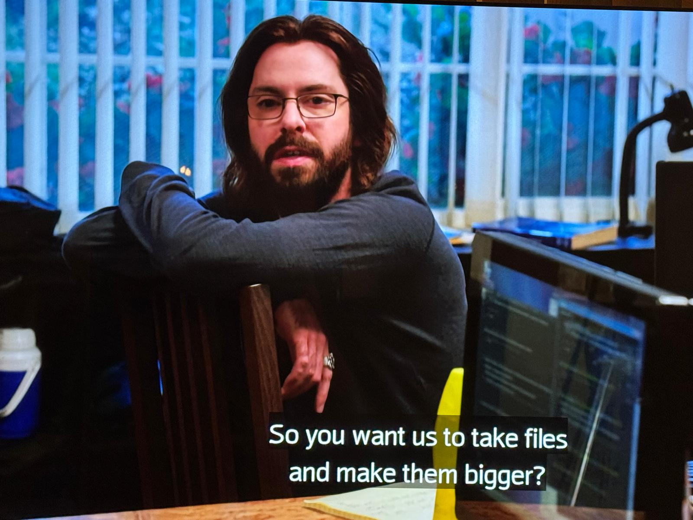

# About 

This is just for fun and learning exp. I mean you can use it, but don't.

Inspired by Augustiner and Gilfoyle:

This is a filesystem which multiplies file size by 10, and it saves it's content to redis... you know.. for stability

Functionality video: 

